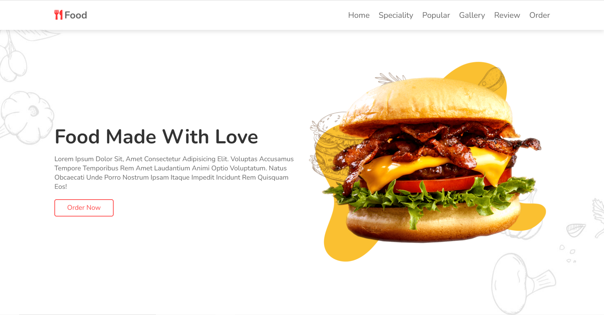

# Sonu Paikrao 

## Preview - https://sonupaikrao.github.io/Fooddelivery-/
A `HTML, CSS, JAVASCRIPT` Project. Made with ♥ by the Vaibhav Paikrao. There will be 6 pages in the website (HomePage, Speciality , Popular , Gallery , Review , Order ). In this project we gonna learn how we can create a website using simple `HTML, CSS & JAVASCRIPT`. The main purpose of the project is to get more used to with HTML, CSS & JAVASCRIPT . Although we used a few lines of React fm in the project for necessary cases. Later on, in this project, we gonna learn how we can deploy this site using `Netlify`. Also, we gonna learn the process from the zero to end and make the website ready for live production.

## What we are going to learn

- HTML, CSS & JAVASCRIPT
- JAVASCRIPT Animation Plugin
- React Framework
- CSS Grid
- CSS Flex
- Scroll Animation
- CSS Beautiful Loader
- More . . .

## Starter files

You can find all the starter files in `Main` branch. You can to go to the `Main` branch and `download zip` the the starter files or You can clone the project and git checkout to `Main` branch.

## Requirements

- Basic HTML, CSS, JAVASCRIPT
- JAVASCRIPT Animation Plugin
- React Framework

## Developer teams of Sonu Paikrao

One Man Show🥰

## Tools Used

1. icons - (flat & Feather icons)
2. illustration - [https://storyset.com/](https://storyset.com/)
2. Images - [https://www.pexels.com](https://www.freepik.com)
3. UI Design: Figma
4. Code Editor: VS Code

## Contributing

Contributions are always welcome! 👇

See `contributors` branch for ways to get started.
